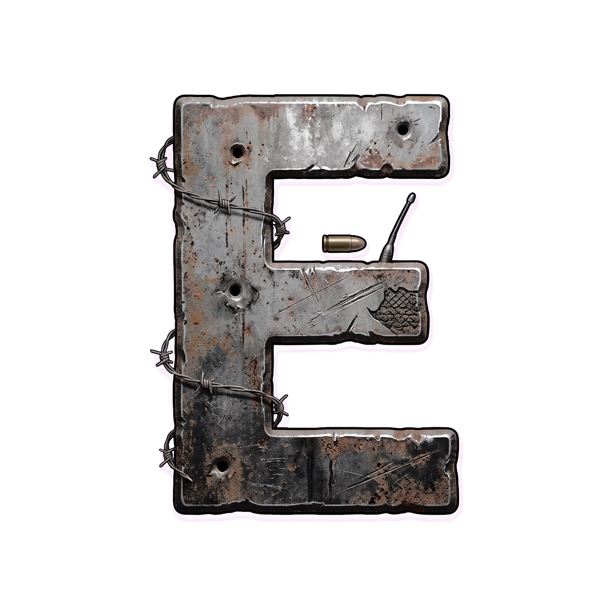
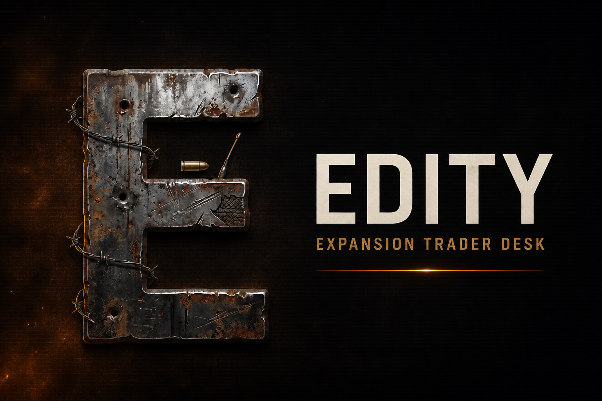
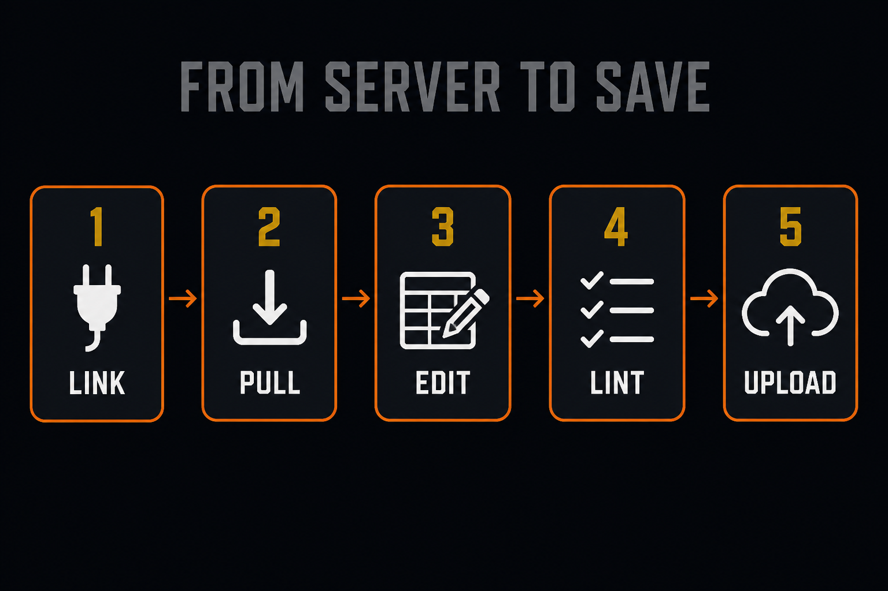
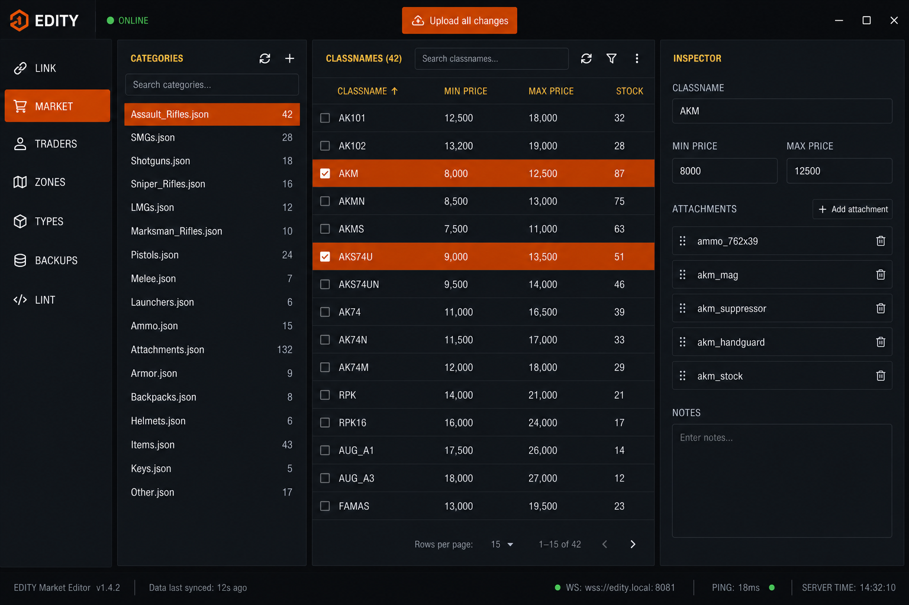
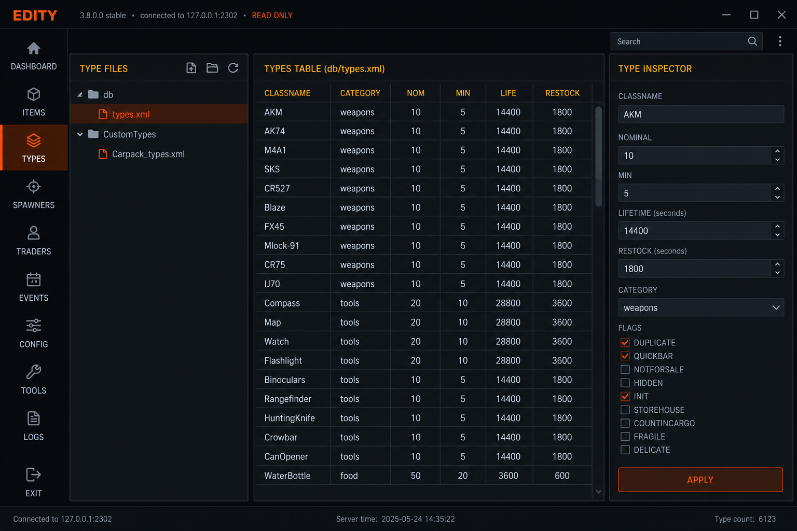

<p align="center">
  
</p>

<h1 align="center">EDITY</h1>

<p align="center">
  <strong>Expansion Trader Desk</strong> — a Windows editor for DayZ Expansion<br>
  Market, Traders, TraderZones, and mission <code>types.xml</code>
</p>

<p align="center">
  <a href="https://github.com/EscapedSheep1/EDITY/releases/latest"></a>
  
  
</p>



EDITY talks to your server over FTP, FTPS, or SFTP, pulls the Expansion JSON and CE types files into a local workspace, lets you edit them in a dark HUD, lints the set, then uploads only what you changed. Credentials stay in Windows Credential Manager. Each upload zips a backup first.



## Download

1. Grab **EDITY-1.0.0-windows-x64.zip** from [Releases](https://github.com/EscapedSheep1/EDITY/releases/latest).
2. Unzip the folder anywhere (Desktop is fine).
3. Run `EDITY.exe`.

You need **Windows 10/11 64-bit**. If the window is blank, install the [WebView2 Runtime](https://developer.microsoft.com/en-us/microsoft-edge/webview2/) (usually already installed with Edge).

Profiles and the local workspace live in `%APPDATA%\EDITY`. Nothing from your server logins is stored in this repo.

---

## Tutorial

### 1. Create a link

Open **LINK**. Fill in a profile:

| Field | Typical value |
| --- | --- |
| Protocol | SFTP (or FTP / FTPS) |
| Host / port | Your box, `22` for SFTP |
| Username / password | Saved into Credential Manager |
| Market path | `/ExpansionMod/Market` |
| Traders path | `/ExpansionMod/Traders` |
| TraderZones path | `/mpmissions/dayzOffline.chernarusplus/expansion/traderzones` |

The TraderZones path is also how EDITY finds the mission folder and `cfgeconomycore.xml`.

Use **Test** to ping the host, **Browse** if you are unsure of the folders, then **Save profile** and **Connect**. Connect pulls every JSON file in those three folders plus the mission types files.

### 2. Edit the market



**MARKET** is a three-pane desk:

- **Left** — category files. Click one. A–Z sort and **NEW** live in the header.
- **Center** — items. Filter classnames, multi-select with Ctrl / Shift / checkboxes. Columns stay in sync as you type.
- **Right** — the selected item, or a bulk editor when more than one row is selected.

Useful actions:

- **Pull types** then add items from the mission catalog. Attachments can be any type; lint will ask you to create a market item if it is missing.
- Right-click rows for **Make variant of…**, infinite stock, or delete.
- **Save + lint** writes the file locally only. It does not upload.

### 3. Traders and zones

**TRADERS** edits display name, currencies, reputation, category stems (must match a market file), and item overrides.

**ZONES** edits name, radius, buy/sell percents, and stock. Stock classnames that are not in any market file are warned, not blocked.

### 4. Types



**TYPES** edits the CE XML that was pulled from the mission (`db/types.xml`, `CustomTypes/…`, and anything listed in `cfgeconomycore.xml`).

- Table of classname, category, nominal, min, lifetime, restock.
- Filters: loot (nominal &gt; 0), nominal 0, no category. Search supports `&&`, `||`, and `!`.
- Inspector covers quant, cost, usage, value, tags, and flags.
- Multi-select bulk edit, duplicate, set nominal 0, copy classnames.
- **NEW** creates a types file (for example `CustomTypes/MyMod_types.xml`) and registers it in `cfgeconomycore.xml`.

`ZmbF_*` and `ZmbM_*` infected types are skipped by lint. Missing category is not a lint warning.

### 5. Lint

Click **LINT** (or save). The drawer lists errors and warnings. Click a row to jump to the file and field.

If an attachment, variant, trader item, or zone stock is not a ClassName or Variant in any market file, use **Add to market…** to drop it into an existing file or a new one.

Upload is blocked while any **error** remains. Warnings do not block.

### 6. Upload

1. Save the files you care about (**Save + lint**).
2. Click the green **Upload all changes** button in the top bar.
3. Confirm. EDITY zips the local workspace, overwrites only dirty files on the server, applies pending deletes, then pulls a fresh copy.

**BACKUPS** lists those zip files under `%APPDATA%\EDITY\backups`.

---

## What EDITY checks

**Market** — display name, color, prices, stock bounds, duplicate classnames, attachments and variants that are not in any market file.

**Traders** — display name, reputation range, category stems that do not match a market file, item modes 0–3.

**Zones** — display name, radius, stock duplicates / negatives; warning if stock is not in market.

**Types** — empty or duplicate classnames, min &gt; nominal, bad quant range, lifetime 0 on loot. Infected `ZmbF` / `ZmbM` types are ignored.

---

## Build from source

```bat
cmake --preset windows-release
cmake --build --preset windows-release --config Release
```

Requirements:

- Visual Studio 2022 or 2026 (C++20, MSVC)
- [vcpkg](https://github.com/microsoft/vcpkg) with the toolchain set in `CMakePresets.json` (`curl` + `nlohmann-json`)
- CMake 3.24+

The HUD in `ui/` is copied next to `EDITY.exe` on every build. For HTML/CSS/JS-only work you can copy `ui\*` into `build\Release\ui\` and restart.

```
cmake --build --preset windows-release --config Release --target edity_tests
build\Release\edity_tests.exe
```

---

## Privacy

- Passwords go to Windows Credential Manager, not the JSON on disk.
- The local workspace and backups stay on that PC in `%APPDATA%\EDITY`.
- Upload only sends files you saved (and any deletes you confirmed).

---

## License

Source is published as-is for people running their own DayZ servers. You are responsible for backups before you overwrite live Expansion files.
